## Linux Virtualization
---
#### Part 1: Introduction to Virtualization Concepts

1. __Virtualization:__ Virtualization is the process of creating virtual instances of computer resources, such as operating systems, storage, and networks, allowing multiple environments to run on a single physical system.

2. __Hypervisor:__ A hypervisor is a software layer that enables virtualization by allowing multiple virtual machines (VMs) to share the same physical hardware.

3. __Virtual Machines (VMs):__ VMs are software-based emulations of a physical computer, running an OS and applications as if they were on a dedicated machine.

4. __Containers:__ Containers are lightweight, portable environments that package an application along with its dependencies, ensuring consistency across different environments.

5. __Key Differences Between VMs and Containers:__

| Virtual Machines  | Containers |
|---------------------|------------|
| Includes full OS, virtual hardware | Shares host OS kernel |
| Requires more resources | Lightweight |
| Strong isolation, each VM runs separately | Process-level isolation |
|  Slightly slower due to full OS overhead | Faster startup  |

#### Part 2: Working with Multipass:
Following the Source Guide
__Source Used:__ [Canonical Install Guide](https://canonical.com/multipass/docs/install-multipass)

__Steps:__

To install multipass:

```
snap install multipass
```
Checking if its installed correctly or not by running this command:
```
ls -l /var/snap/multipass/common/multipass_socket
```
Expected result:
```
srw-rw---- 1 root sudo 0 Dec 19 09:47 /var/snap/multipass/common/multipass_socket
```
Found result:
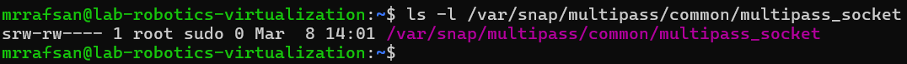

Launching the default Mulitpass ubuntu instance:
```
multipass launch
```
I get a `launch failed` error and telling me to run `multipass authenticate` command first.

__But I used:__
```
sudo multipass launch
```
__Reason:__ When running Multipass commands, authentication happens automatically in the background.

Result:

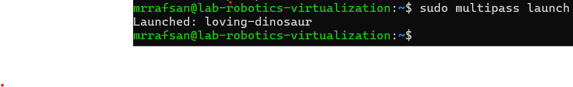

__Listing instances:__
Command: 
```
sudo multipass list
```
Result:

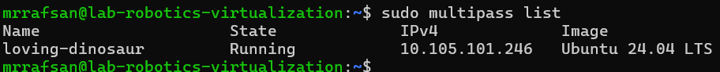

__Multipass instance info:__
Command:
```
sudo multipass info loving-dinosaur
```
Result:

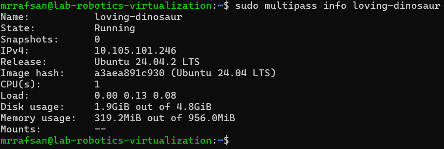

__Multipass Shell access:__
Command:
```
sudo multipass shell loving-dinosaur
```
Result:

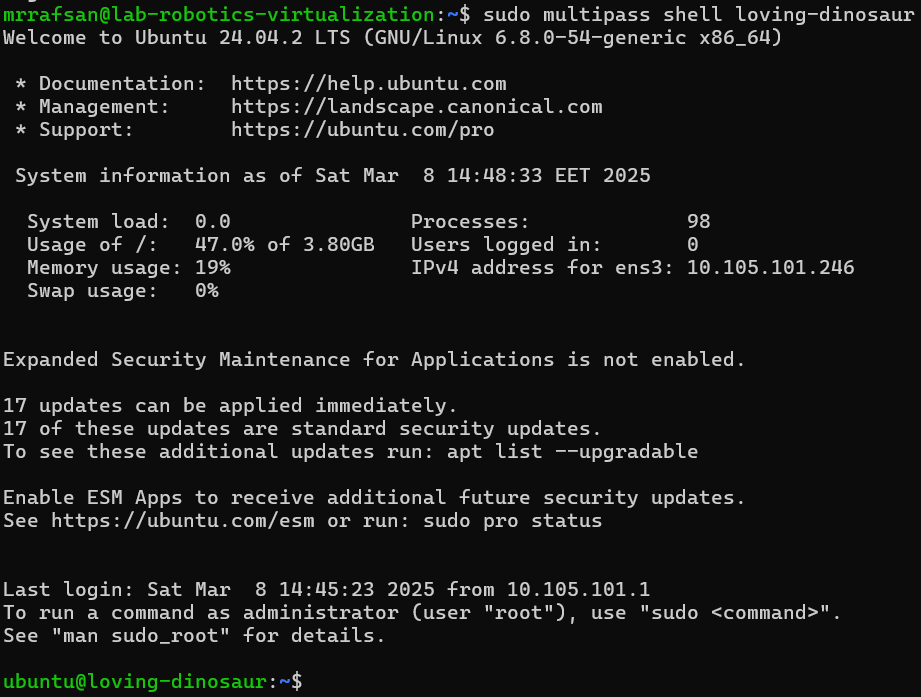

I created a file in the instance home directory and named it 'hello_world.txt'.
Now trying to read the file outside the instance using the cat command.

Command:
```
sudo multipass exec loving-dinosaur -- cat hello_world.txt
```
Result:

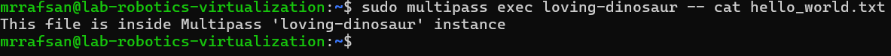

__Stopping the instace:__

```
sudo multipass stop loving-dinosaur
```

__Delete the instance:__

```
sudo multipass delete loving-dinosaur
```

```
sudo multipass list
```

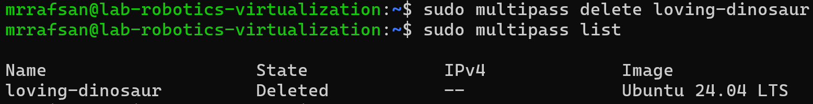


__Cloud-init Experiment:__

created the **"cloud-init.yml"** file.

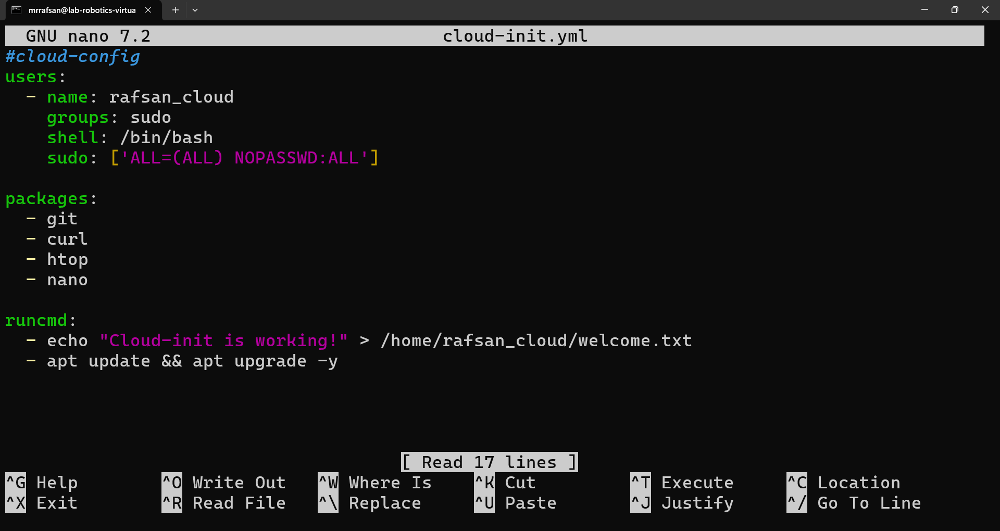

The config file will install some basic packeges and after successfully starting the instance it will return "Cloud-init is working!" from the welcome.txt file which will create after running the first time.

__Commnad:__

```
sudo multipass launch --name cloud-init --cloud-init cloud-init.yml
```
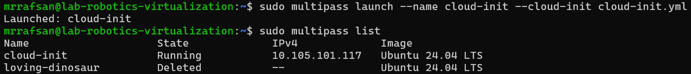
Then accessed shell using

```
sudo multipass shell cloud-init
```
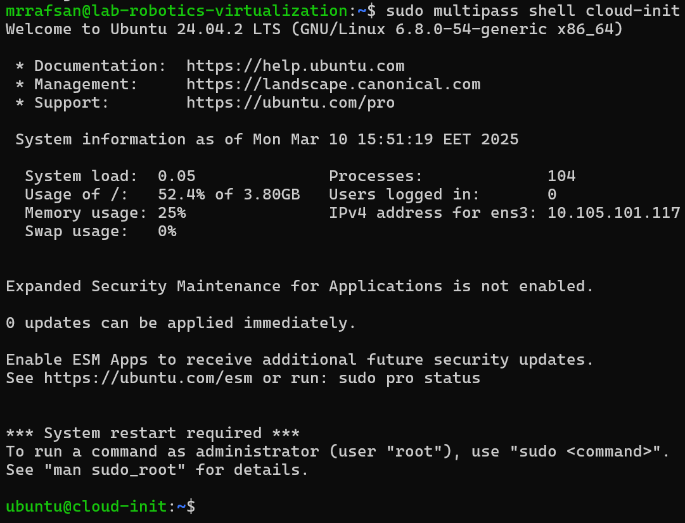
Now checking if the user rafsan_cloud exist.
__command:__

```
cat /etc/passwd | grep rafsan_cloud
```
__Result:__
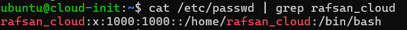
Verifying welcome.txt
```
sudo cat /home/rafsan_cloud/welcome.txt
```
__Result:__
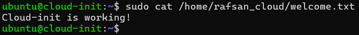

Using sudo because the file was created by root and was accessable by rafsan_cloud.
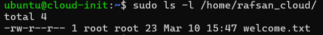

created a folder in the host machine named "host_machine" and created another folder in instance called "shared_folder". then mounted the folder on the host machine using:

```
sudo multipass mount ~/host_machine cloud-init:/home/ubuntu/shared_folder
```
